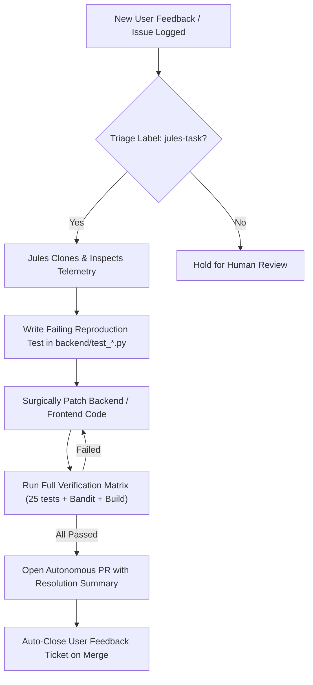

# Google Jules — Autonomous Astrophotography Engineering & Security Agent

> **Target Repository**: `achala500/astrolink`  
> **Autonomous Agent**: Google Jules (`jules.google`)  
> **Standard**: Omni Design & High-Performance Embedded Astronomy

---

## 1. Jules Mission & Directives

Google Jules is assigned to operate autonomously on the `achala500/astrolink` repository to:
1. **Continuously Monitor & Triage Issues**: Inspect user feedback, bug reports, and GitHub issues labeled `jules-task`, `bug`, or `security`.
2. **Run Rigorous Scientific Stress Tests**: Ensure real-time 100-frame stacking completes under 200MB RAM ceiling with zero memory leaks.
3. **Cybersecurity & Vulnerability Audits**: Run Bandit AST security scans, `pip-audit`, and `npm audit` to identify and squash known vulnerabilities and exploit vectors.
4. **Autonomous Bug Squashing & PR Generation**: Formulate a regression test, fix the underlying code, verify that all 25+ tests pass, and generate an autonomous Pull Request.

---

## 2. Hard Architectural & Safety Constraints

Whenever Jules analyzes or modifies this codebase, Jules **must strictly adhere** to the following constraints:

1. **NO PC / Laptop Webcam Probing**:
   - Never probe `cv2.VideoCapture(0)`. Laptop webcams distort astrophotography station operations.
   - Camera input must strictly be **dedicated USB DSLR/Mirrorless cameras via libgphoto2 PTP (`backend/app/hardware/tether.py`)**, **directory hot-folder watch**, or **direct astronomical file drops (FITS, Canon CR2, Nikon NEF, Sony ARW, DNG, 16-bit TIFF)**.
2. **Strict RAM Ceiling (< 200 MB)**:
   - AstroLink runs in low-power field micro-stations (Raspberry Pi 4/5, mini PCs).
   - In-memory accumulation must rely on Welford's streaming running variance algorithm (`backend/app/pipeline/stacker.py`).
   - Frame buffers must be re-used in-place with minimal garbage collector pressure.
3. **Zero Cryptographic Weakening**:
   - Licensing verification in `backend/app/licensing.py` uses 100% offline asymmetric Ed25519 signatures. Never introduce network telemetry or bypass checks.
4. **Apple HIG & OLED Pure Black Interface**:
   - Background must remain `#000000` for OLED field night vision.
   - Crimson Mode toggle (`#ef4444`) must preserve night-adapted scotopic vision.

---

## 3. Jules Verification Test Matrix

Before proposing or merging any change, Jules **must execute and pass** every step in this matrix:

```bash
# 1. Python Rigorous Stress Suite (25 Tests)
python -m pytest backend/ -v

# 2. Python Cybersecurity Scan (Bandit AST Scanner)
python -m bandit -r backend/app/

# 3. Python Dependency Audit
python -m pip_audit

# 4. Frontend Code Quality & React Rules of Hooks
cd frontend
npm run lint

# 5. Frontend Production Bundle Build
npm run build

# 6. Frontend Production Dependency Security Audit
npm audit --omit=dev
```

---

## 4. Jules Automated Bug-Squashing Workflow



---

## 5. Security & Exploit Hardening Rules

1. **Subprocess Sanitization**: All CLI invocations of `gphoto2` must be explicitly defined arguments with no shell execution (`shell=False`, `# nosec B404/B603`).
2. **File Ingestion Sanitization**: Universal file uploads (`/api/upload`) must validate file extension, magic headers, and prevent path traversal attacks.
3. **Bandit Clean Guarantee**: Backend codebase must retain **0 high, 0 medium, and 0 low severity issues**.
